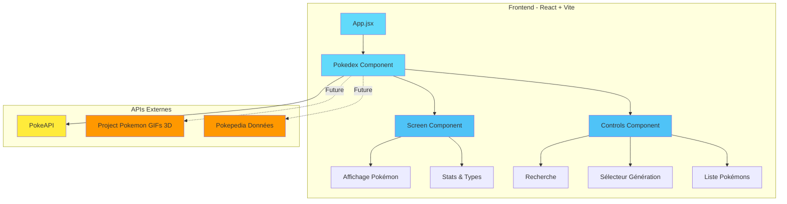
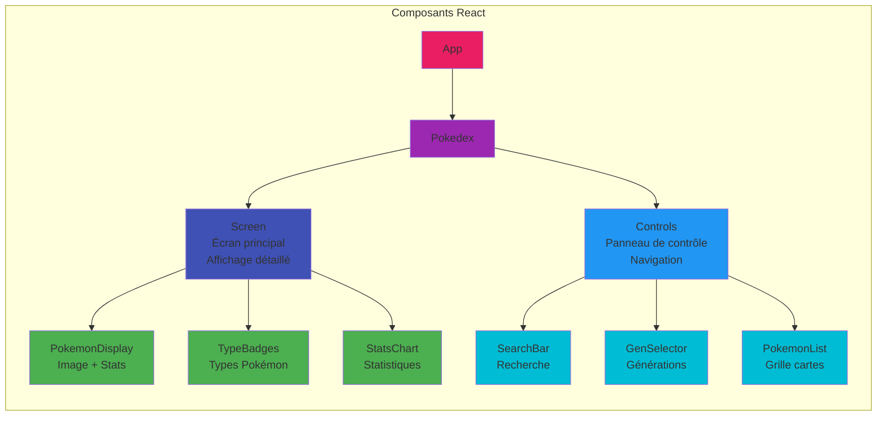
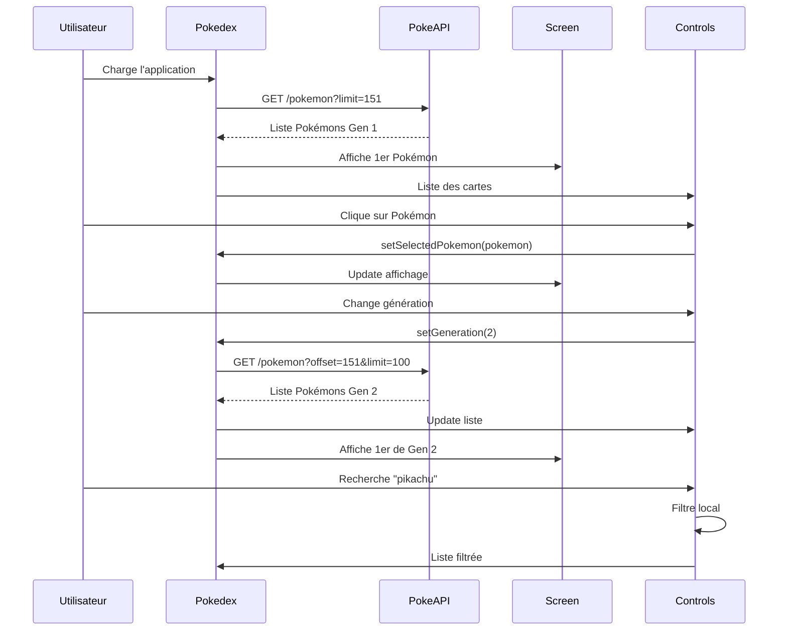
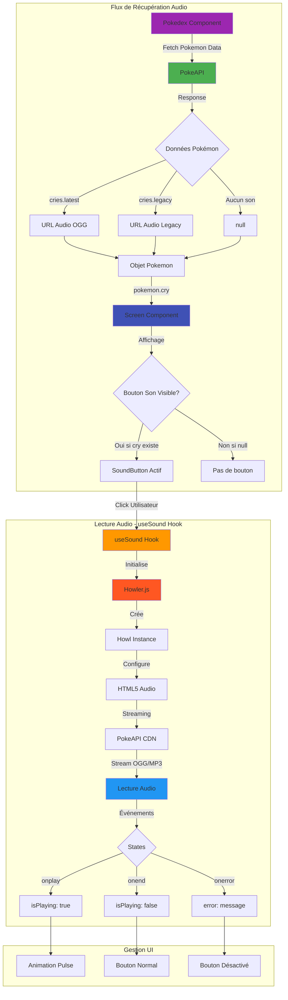
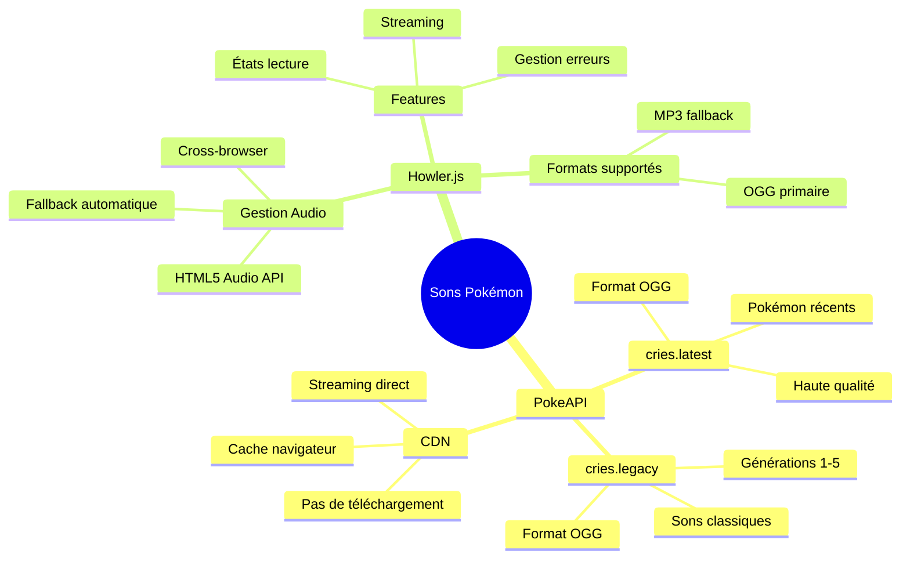
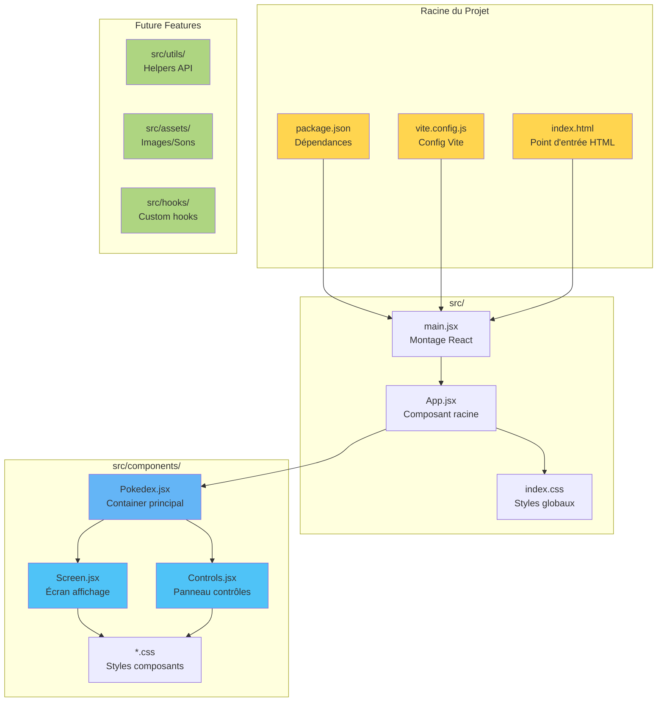
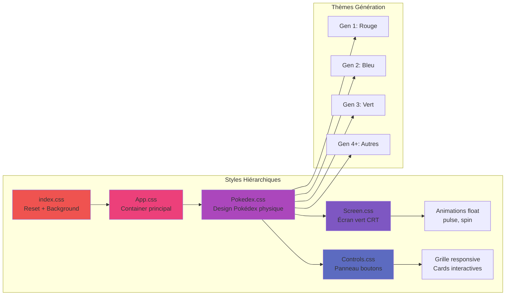
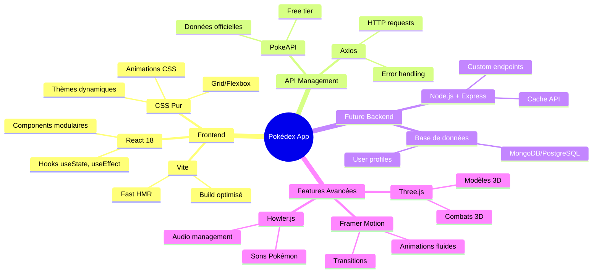
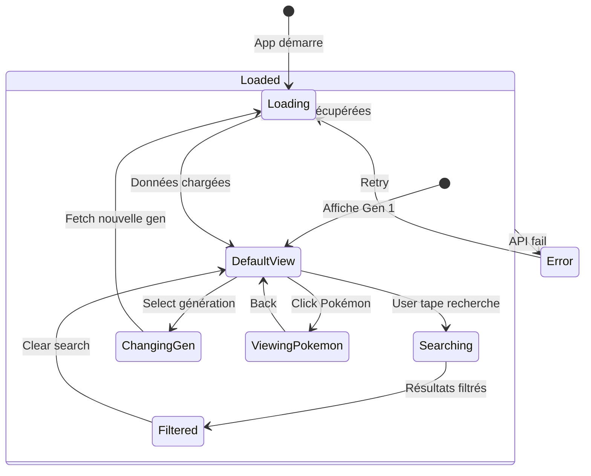
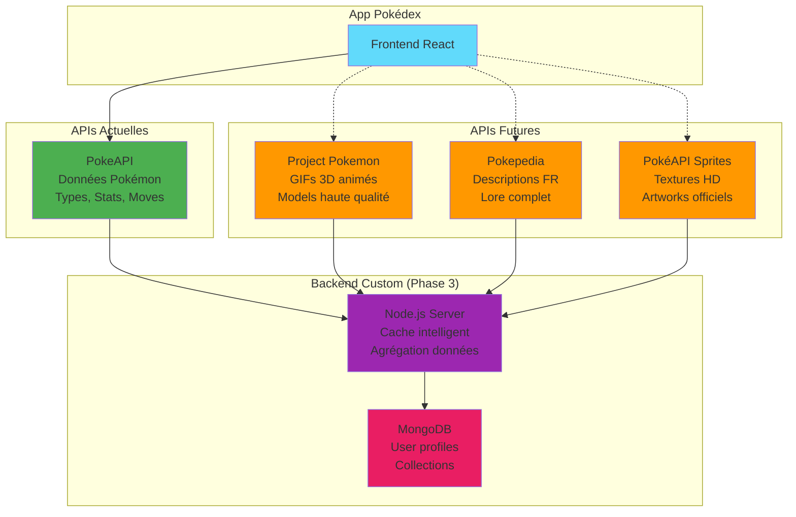

# 📚 Architecture du Projet Pokédex

## 🎯 Diagramme d'Architecture Globale



## 🏗️ Structure des Composants



## 🔄 Flux de Données



## 🔊 Architecture Audio - Récupération des Sons



## 📡 Sources des Données Audio



## 🎵 Détails Techniques Audio

### URLs des Cris Pokémon

Les sons sont fournis directement par **PokeAPI** dans la réponse des détails du Pokémon :

```javascript
// Exemple de réponse PokeAPI
{
  "id": 25,
  "name": "pikachu",
  "cries": {
    "latest": "https://raw.githubusercontent.com/PokeAPI/cries/main/cries/pokemon/latest/25.ogg",
    "legacy": "https://raw.githubusercontent.com/PokeAPI/cries/main/cries/pokemon/legacy/25.ogg"
  }
}
```

### Stratégie de Récupération

1. **Priorité** : `cries.latest` (sons les plus récents)
2. **Fallback** : `cries.legacy` (sons classiques)
3. **Aucun son** : Bouton masqué

### Howler.js - Pourquoi ?

- ✅ **Cross-browser** : Fonctionne partout
- ✅ **Streaming** : Pas de préchargement complet
- ✅ **Léger** : ~7KB gzippé
- ✅ **Gestion automatique** : États, erreurs, formats
- ✅ **HTML5 Audio** : Performance optimale

### Format Audio

- **OGG Vorbis** : Format principal (meilleure qualité/taille)
- **MP3** : Fallback automatique si OGG non supporté
- **Streaming** : Lecture directe sans téléchargement
- **Cache** : Géré par le navigateur


## 📦 Structure des Fichiers



## 🎨 Architecture CSS (Thème Pokédex)



## ️ Stack Technique Détaillée



## 📊 Gestion d'État (State Management)



## 🌐 Intégrations APIs Planifiées



---

## 📝 Notes Techniques

### Choix de React + Vite
- **React** : Parfait pour SPA, composants réutilisables, écosystème riche
- **Vite** : Setup rapide, HMR ultra-rapide, moderne
- **CSS Pur** : Pas de dépendance lourde, maîtrise totale, légère
- **PokeAPI** : Gratuite, complète, bien documentée

### Avantages de cette architecture
1. **Simple à maîtriser** : Stack légère, peu de dépendances
2. **Évolutive** : Facile d'ajouter des features progressivement
3. **Performante** : Vite + React optimisé
4. **Pas de backend au début** : Focus sur le front
5. **Visuel fidèle** : Design Pokédex authentique

### Pour la roadmap détaillée
Consultez le fichier [ROADMAP.md](ROADMAP.md) pour le planning complet des phases de développement.
