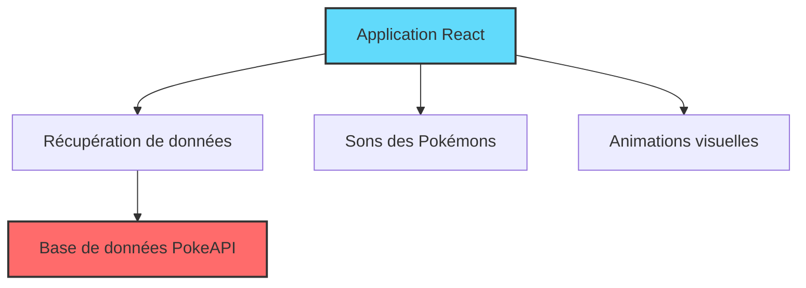
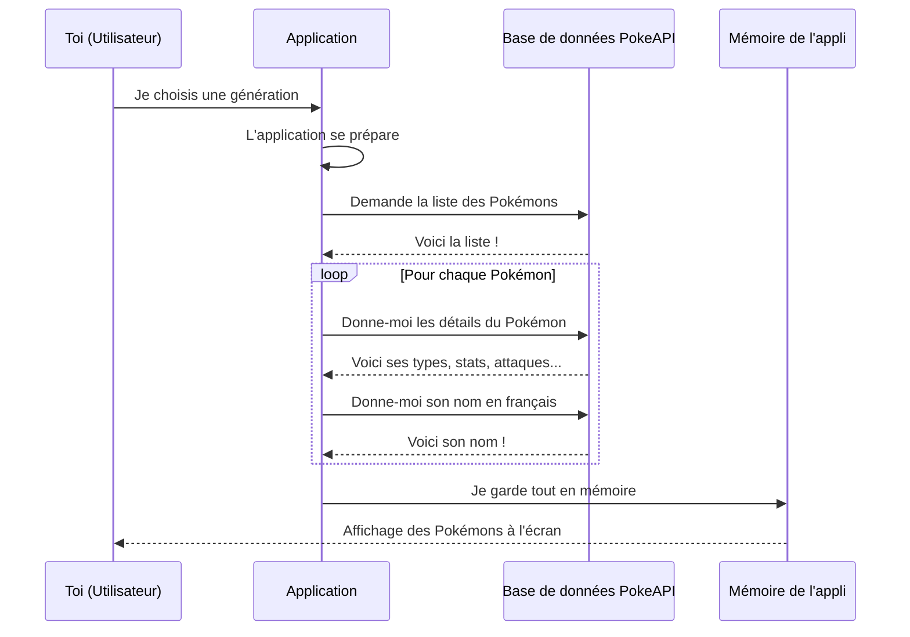
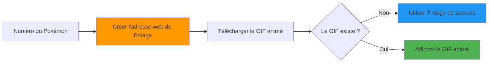
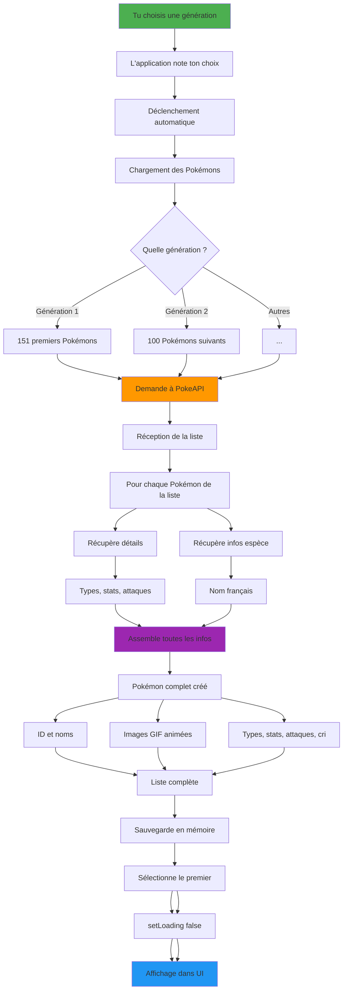
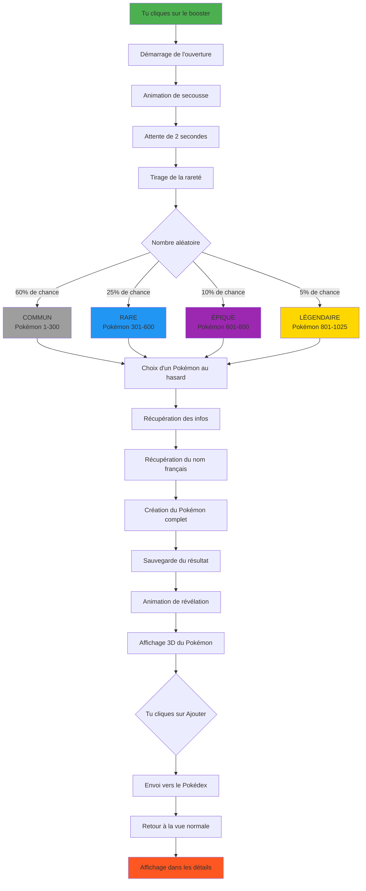
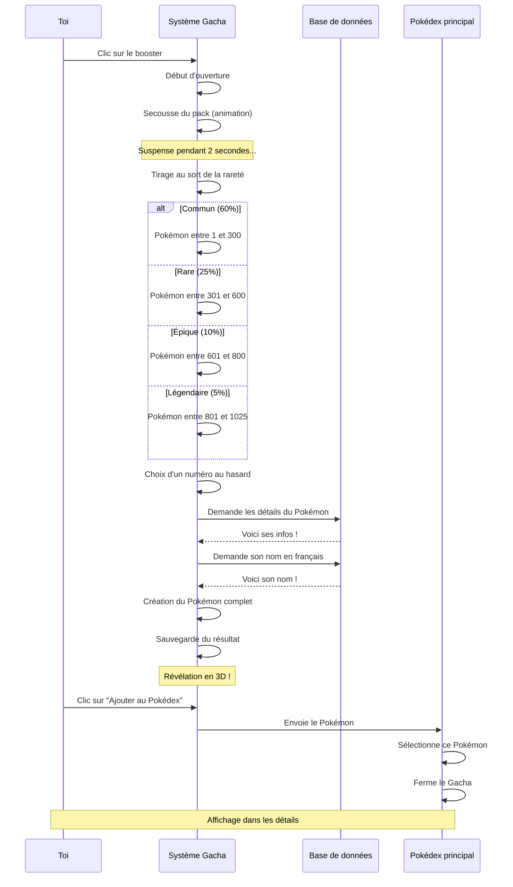
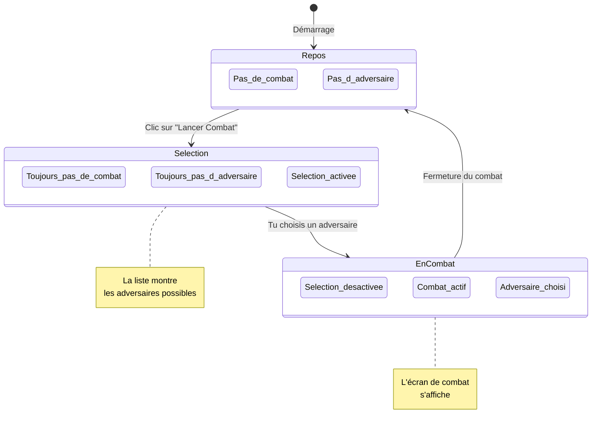

# 📊 Diagrammes des Fonctionnalités - Pokédex

## 🎮 Technologies Principales



**Ce schéma montre :**
- L'application est construite avec React (un outil pour créer des sites web)
- Elle va chercher les informations sur PokeAPI (une base de données gratuite)
- Elle affiche les Pokémons avec du son et des animations

---

## 1️⃣ Comment l'application récupère les Pokémons

### Vue d'ensemble



**Explication simple :**
- Tu choisis une génération (1, 2, 3...)
- L'application demande la liste à internet
- Pour chaque Pokémon, elle récupère toutes ses infos
- Tout s'affiche joliment à l'écran !

### Images des Pokémons

**Comment ça marche ?**

L'application affiche de beaux GIFs 3D animés des Pokémons. Voici le processus :



**Explication simple :**
- Chaque Pokémon a un numéro (Pikachu = 25, Bulbizarre = 1)
- Ce numéro permet de trouver son GIF animé sur le site Project Pokemon
- SiProcessus complet détaillé



**En résumé :**
1. L'utilisateur choisit une génération (1, 2, 3...)
2. L'application demande la liste des Pokémons à l'API
3. Pour chaque Pokémon, on récupère ses informations détaillées
4. Tout s'affiche à l'écran

---

## 2️⃣ Système Gacha (Ouverture de Boosters)

### Comment ça marche



### Étapes du processus



**Probabilités de rareté :**
- 60% de chance d'obtenir un Pokémon COMMUN
- 25% de chance d'obtenir un Pokémon RARE
- 10% de chance d'obtenir un Pokémon ÉPIQUE
- 5% de chance d'obtenir un Pokémon LÉGENDAIRE

**Le processus :**
1. Tu cliques sur le booster → Animation de secousse
2. Attente de 2 secondes (suspense !)
3. Tirage aléatoire selon les probabilités
4. Révélation en 3D du Pokémon obtenu

---

## 3️⃣ Système de Combat

### Architecture globale

```mLes différentes vues de l'application

```mermaid
stateDiagram-v2
    [*] --> VueNormale: Démarrage de l'appli
    
    VueNormale --> SelectionAdversaire: Clic sur "Lancer Combat"
    Note right of VueNormale: Vue normale :<br/>Liste + Détails
    
    SelectionAdversaire --> Combat: Tu choisis un adversaire
    Note right of SelectionAdversaire: Mode sélection :<br/>Liste des adversaires
    
    Combat --> VueNormale: Fermeture du combat
    Note right of Combat: Vue combat :<br/>Face à face
    
    state VueNormale {
        [*] --> Ecran_Details
        [*] --> Liste_Pokemon
        Ecran_Details --> Selection
        Liste_Pokemon --> Selection
    }
    
    state Combat {
        [*] --> Affichage_Combat
        Affichage_Combat --> Animations_Attaque
        Affichage_Combat --> Comparaison_Stats
    }
```

**Explication :**
- **Vue normale** : Tu vois la liste des Pokémons et les détails de celui que tu as choisi
- **Mode sélection** : Tu choisis qui va être ton adversaire
- **Vue combat** : Les deux Pokémons se font face avec leurs statistiques

### Les 4 phases d'un combat

```mermaid
sequenceDiagram
    participant U as Toi
    participant E as Écran des détails
    participant P as Pokédex principal
    participant L as Liste
    participant C as Écran de combat

    Note over U,C: PHASE 1 : DÉCLENCHEMENT
    
    U->>E: Clic sur "⚔️ Lancer un Combat"
    E->>P: Signal de démarrage
    P->>P: Mode sélection activé
    P->>L: Active la liste des adversaires
    L->>L: Affiche tous les Pokémons disponibles
    
    Note over U,C: PHASE 2 : CHOIX DE L'ADVERSAIRE
    
    U->>L: Clic sur un adversaire
    L->>P: Voici ton choix !
    P->>P: Sauvegarde le joueur
    P->>P: Sauvegarde l'adversaire
    P->>P: Active le mode combat
    P->>P: Désactive la sélection
    
    Note over U,C: PHASE 3 : AFFICHAGE DU COMBAT
    
    P->>C: Lance l'écran de combat<br/>avec les 2 Pokémons
    C->>C: Affichage face à face
    C->>C: Comparaison des stats
    C->>C: Animations d'attaque
    
    Note over U,C: PHASE 4 : FIN DU COMBAT
    
    U->>C: Clic sur "Fermer"
    C->>P: Signal de fermeture
    P->>P: Désactive le mode combat
    P->>P: Supprime l'adversaire
    P->>E: Retour à la vue normale
    P->>L: Retour à la
**Comment lancer un combat :**
1. Clique sur le bouton "⚔️ Lancer un Combat"
2. Choisis un adversaire dans la liste
3. Les deux Pokémons apparaissent face à face
4. Compare leurs statistiques !
5. Ferme pour revenir à la vue normale
Organisation de l'application

### Comment les parties communiquent entre elles

```mermaid
graph TB
    subgraph Pokedex["POKÉDEX (Cerveau de l'application)"]
        direction TB
        States["Mémoire :<br/>Liste des Pokémons, Pokémon sélectionné<br/>Recherche, Génération choisie<br/>Mode Combat, Adversaire"]
        Logic["Actions possibles :<br/>Charger les Pokémons<br/>Démarrer un combat<br/>Ajouter un Pokémon du Gacha"]
    end
    
    subgraph Components["Les différentes sections visibles"]
        Controls["LISTE & FILTRES<br/>Liste de tous les Pokémons<br/>Barre de recherche<br/>Choix de génération<br/>Bouton Gacha<br/>Sélection d'adversaire"]
        Screen["DÉTAILS<br/>Infos du Pokémon choisi<br/>Statistiques et Types<br/>Liste des attaques<br/>Bouton Combat"]
        Battle["COMBAT<br/>Interface de combat<br/>Affichage face à face<br/>Animations"]
        Gacha["GACHA<br/>Ouverture de booster<br/>Système de rareté<br/>Animations du pack"]
    end
    
    subgraph External["Ce qui vient d'internet"]
        PokeAPI["BASE DE DONNÉES<br/>Infos des Pokémons<br/>Noms en français"]
        Audio["SONS<br/>Cris des Pokémons"]
    end
    
    Pokedex -->|Envoie les infos| Controls
    Pokedex -->|Envoie les infos| Screen
    Pokedex -->|Afficher ou cacher| Gacha
    Pokedex -->|Activer ou désactiver| Battle
    
    Controls -->|Signale les actions| Pokedex
    Screen -->|Signal de combat| Pokedex
    Gacha -->|Envoie le Pokémon obtenu| Pokedex
    Battle -->|Signal de fermeture| Pokedex
    
    Logic -->|Demande des infos| PokeAPI
    Screen -->|Joue| Audio
    
    style Pokedex fill:#61dafb
    style Controls fill:#4CAF50
    style Screen fill:#2196F3
    style Battle fill:#FF5722
    style Gacha fill:#9C27B0
    style PokeAPI fill:#ff6b6b
```

**Comment ça fonctionne :**
- Le **Pokédex** est le cerveau qui contrôle tout
- Les **sections visibles** (Liste, Détails, Combat, Gacha) affichent les choses
- Quand tu cliques, l'information remonte au Pokédex
- Le Pokédex décide quoi faire et met à jour l'affichage

### Les états du combat



**Les 3 états possibles :**
1. **Repos** : Tu navigues normalement dans le Pokédex
2. **Sélection** : Tu es en train de choisir un adversaire
3. **En combat** : Deux Pokémons se font face à l'écran     BattleShowdown
        affiché
    end note
```

---

## 📚 Technologies Utilisées (explications simples)

### 🎨 Interface graphique
- **React** : La bibliothèque qui crée l'interface que tu vois à l'écran
- **Vite** : L'outil qui rend l'application rapide et fluide
- **CSS** : Ce qui rend l'application jolie (couleurs, animations, effets)

### 🔊 Son
- **Howler.js** : Permet de jouer les cris des Pokémons

### 🌐 Données externes
- **PokeAPI** : Le site web qui fournit toutes les informations sur les Pokémons (noms, types, statistiques...)
- **Project Pokemon** : Le site qui fournit les GIFs animés en 3D
- **Axios** : Le messager qui va chercher les informations sur internet

### 💡 Communication entre les parties
- Les différentes sections de l'application se parlent entre elles
- Quand tu cliques quelque part, l'information se propage
- C'est comme un jeu de téléphone arabe, mais sans erreurs !
    
    Logic -->|axios| PokeAPI
    Screen -->|play| Audio
    
    style Pokedex fill:#61dafb
    style Controls fill:#4CAF50
    style Screen fill:#2196F3
    style Battle fill:#FF5722
    style Gacha fill:#9C27B0
    style PokeAPI fill:#ff6b6b